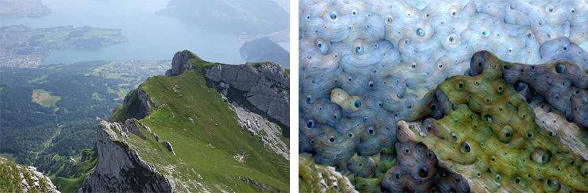

# 🌈 DeepDream TensorFlow

This is a simple implementation of **Google DeepDream** with **TensorFlow**.

Nothing new, but pretty fun :)



# 📦 Installation

Clone this project

```sh
git clone https://github.com/micheleriva/DeepDream-TensorFlow.git
```

Install project dependencies using pip

```sh
pip install pillow numpy tensorflow scipy
```

Run the main script with any image!

```sh
python main.py ./demoimgs/demo.jpeg 6 123
```

Arguments:

| Argument    | Values                              | Default              |
|-------------|-------------------------------------|----------------------|
| imagePath   | String: Relative path of your image | ./demoimgs/demo.jpeg |
| tensorLayer | Int(1,9)                            | 5                    |
| tensorModel | Int(1,255)                          | 123                  |

# 📜 License

[MIT](LICENSE.md)